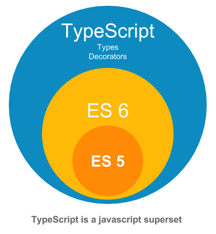

# All TypeScript Fundamentals in One Place

## 1- Introduction & Prerequisites :



Programming language divide into two categories :

- `Statically typed`
- `Dynamically typed`

in `Statically-typed` languages (C, Java, C#, ... ), the type of variable is set at the compile-time and cannot change later.

in `Dynamically-typed` languages (PHP, JavaScript, Python, ... ), the type of variable is determined at the run-time and can change later.

`TypeScript` is a programming language build on top of `JavaScript` ( essentially JavaScript with static typing and some additional features ) , so before we star make sure that you are familiar with this concepts in javascript:

- Variables
- Arrays
- Objects
- Functions
- Arrow Functions
- Destructuring
- ...

## 2- Fundamentals :

### Build-in Types :

as we know `JavaScript` has build-in types like :

- number
- string
- boolean
- array
- object
- undefined
- null

So `TypeScript` extend this list and introduce some new build-in types such as :

- any
- unknown
- never
- enum
- tuple

`1- The any type :` when you declare a variable and don't initialize it , the typescript compiler will assume that variable is type of `any` which means you can assign any type of data into it , here is an example :

```typescript
let anyType; // let anyType: any

anyType = 12;

console.log(typeof anyType); // output: number

anyType = "Random string";

console.log(typeof anyType); // output: string
```

`Note :` If you want to declare a variable of `number, string, ...,` or a function you just need to use this syntax :

```typescript
let numberType: number = 12;
let numberType: string = 12;

function taxe(income: number): number {
  return income * 0.2;
}
```

`2- Arrays :`

```typescript
let numbers = [1, 2, 3]; // let numbers: number[] = [1, 2, 3]

let anyTypes = []; // let anyTypes: any[]

anyType[0] = 100;
anyType[0] = "r_string";

let names = ["ahmed", "zineddine"]; // let names: string[] = ["ahmed", "zineddine"]
```

`3- Tuples :` A tuple is a typed array with a pre-defined length and types for each index.

```typescript
let employee: [number, string] = [1, "Steve"];
```

`4- Enums :`

```typescript
// const small = 1;
// const medium = 1;
// const large = 1;

const enum Size {
  Small = 1,
  medium,
  large,
}

let mySize: Size = Size.Small;

console.log(mySize); // output : 1
```

`4- Objects :`

```typescript
/*
let employee: {
  id:number,
  name:string
} = {
  id:1,
  name:'zineddine'
}
*/

let employee = {
  id: 1,
  name: "zineddine",
};

let user: {
  readonly id: number;
  name: string;
  pseudo?: string;
  retire: (date: Date) => void; // function declaration
} = {
  id: 1,
  name: "zineddine",
  retire: (date: Date) => {
    console.log(date);
  },
};

user.id = 10; // Cannot assign to 'id' because it is a read-only property
```
